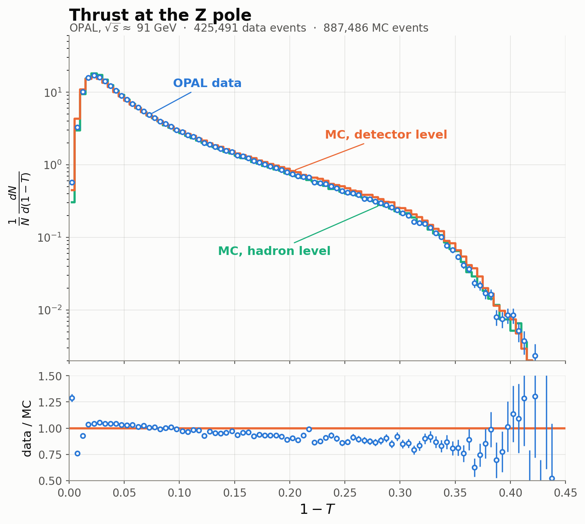

# Sanity check: thrust at the Z pole

The cheapest end-to-end check that the conversion is faithful is to plot
something whose shape is known independently. Thrust at the Z pole is ideal:
its distribution is textbook, and any unit, normalisation or index error in the
mapping would distort it visibly.



Produced by `scripts/plot_thrust_zpole.py` from the stage-1 trees:
425 491 data events (8 Z-peak files) and 887 486 MC events (34 files), with a
>= 5-track multihadron selection. Binned values are in
[`thrust-zpole.csv`](thrust-zpole.csv).

**The ntuple stores `1-T`, not `T`.** The median is 0.045, i.e. T = 0.955.
`Tdtc` (tracks+clusters), `Tdt` (tracks), `Tdc` (clusters) and `Tdmt` (MT
package) are the four detector-level definitions; `Th` and `Tp` are the hadron-
and parton-level truth.

## What it shows

The distribution peaks at `1-T` ~ 0.025 (T ~ 0.975, the 2-jet region) and falls
over three decades into the 3-jet tail. Two features are worth reading:

**Detector smearing is small at the Z pole.** The detector-level and hadron-level
MC curves nearly coincide. That is independent corroboration of the finding in
[`ntuple-schema.md`](ntuple-schema.md) that the Z-pole hadron-level block is
sound (sum(E)/sqrt(s) = 1.000); truth and reconstruction agreeing this closely
is what should happen when both are trustworthy. The same curve is *not*
meaningful for the LEP2 four-fermion samples, where that block is anomalous.

**Data sits ~10-15% below MC in the 3-jet tail** (`1-T` >~ 0.2). This is a real
physics feature rather than a conversion artefact: that region is sensitive to
alpha_s and the parton shower, where LEP-era generators were known to need
tuning. It is also the useful part of the check -- a units or normalisation bug
in the mapping would show up as a slope or a step across the whole range, not as
a smooth deviation confined to the hard-gluon region.

## Reproducing

```sh
python3 scripts/plot_thrust_zpole.py <dir-of-stage-1-trees> out.png
REPLOT=1 python3 scripts/plot_thrust_zpole.py <dir> out.png   # restyle from the CSV
```

The script accumulates histograms in bounded chunks rather than reading arrays,
and caches the binned result, so a restyle costs nothing and a full run stays
within the memory budget described in `CLAUDE.md`.
